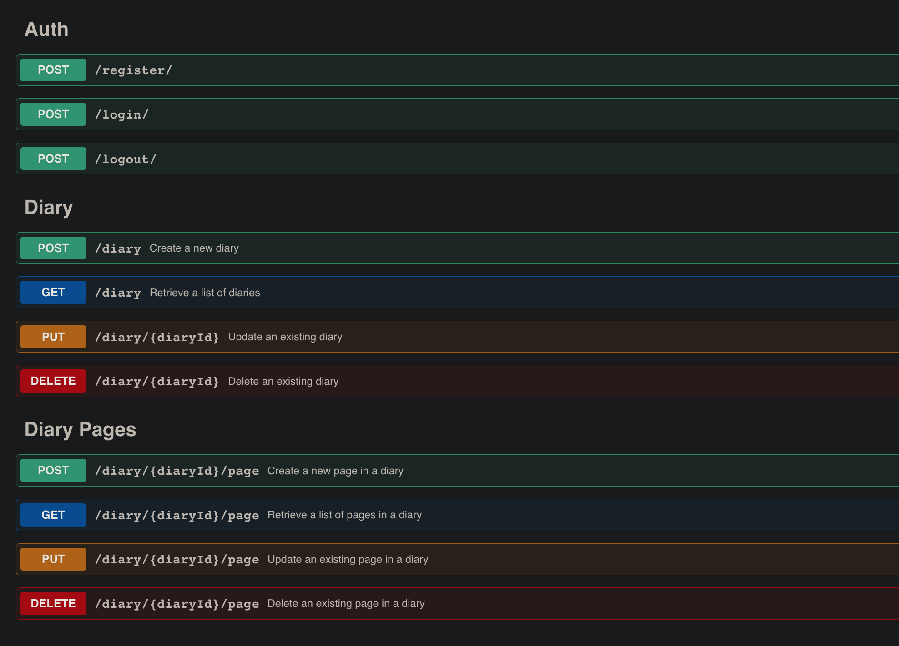
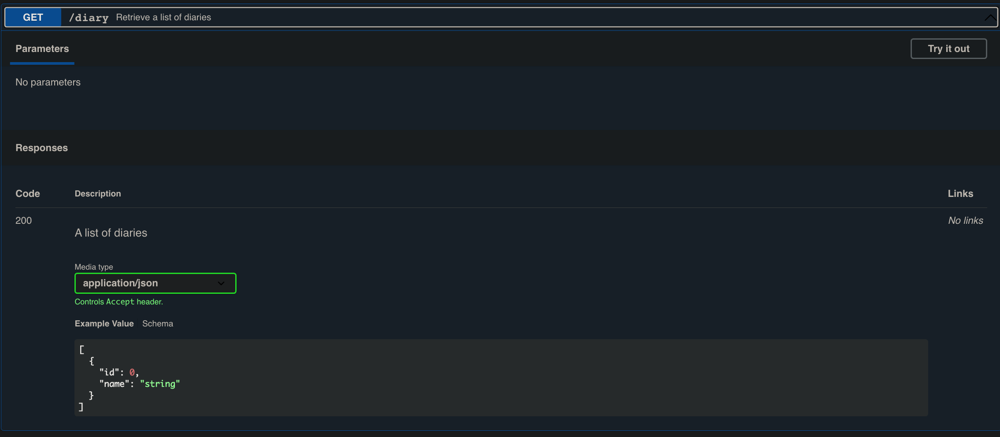
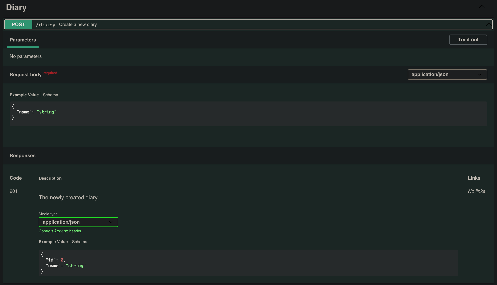

# Задание на 01.23

С многострадальной базой наконец закончили, пора и api писать.

### Что такое API?
Веб-API — это способ взаимодействия различных программных систем и обмена информацией через Интернет. Это набор правил и протоколов, который позволяет одной системе получать доступ и использовать функциональные возможности или данные другой системы. Думайте об этом как о телефонном звонке между двумя людьми, где API — это телефон, а две системы — это люди, участвующие в разговоре. API позволяет двум системам понимать друг друга и обмениваться информацией.

#### Например:
```python
from flask import Flask, jsonify

app = Flask(__name__)

# определить некоторые образцы данных
books = [
    {'id': 1, 'title': 'Harry Potter', 'author': 'J.K. Rowling'},
    {'id': 2, 'title': 'The Lord of the Rings', 'author': 'J.R.R. Tolkien'},
    {'id': 3, 'title': 'The Hitchhiker\'s Guide to the Galaxy', 'author': 'Douglas Adams'},
]

# определить маршрут для конечной точки API
@app.route('/books')
def get_books():
    return jsonify(books)

if __name__ == '__main__':
    app.run(debug=True)
```
В этом примере создается простой веб-API с использованием Flask, предоставляющий единственную конечную точку /books, которая возвращает список книг в формате JSON. Функция jsonify() используется для преобразования списка книг в ответ JSON, который может быть легко использован другими системами.

Когда вы запустите этот сценарий, API будет доступен по адресу http://localhost:5000/books, и вы сможете получить доступ к данным о книгах, отправив запрос GET на эту конечную точку.

Это всего лишь простой пример, но в реальном API у вас может быть несколько конечных точек, использование базы данных для хранения данных и включение механизмов аутентификации и авторизации для безопасного доступа.

---
#### Дополнительно:
- [Статья на Хабре](https://habr.com/ru/post/464261/)

## Посмотрим на наше API
Для этого открываем файл Diary_API.yaml на сайте https://editor-next.swagger.io/



Нас встречает красивая картина с разными конечными точками (endpoints). Кстати, в программистских кругах их часто называют "ручками". 

Откроем одну из них.



Здесь мы видим данные, которые мы должны получить, обратившись на ручку. В нашем случае это список дневников пользователя. Это GET запрос, то есть данные мы не передаем, а получаем.



А вот если захотим создать.

Здесь уже нужно в теле запроса послать название нашего словаря.

### Пример реализации части API

```python
from diary import FastAPI, HTTPException
from pydantic import BaseModel

app = FastAPI()

class Diary(BaseModel):
    name: str

class Page(BaseModel):
    text: str

diary_db = {}

@app.post("/diary")
def create_diary(diary: Diary):
    diary_id = len(diary_db) + 1
    diary_db[diary_id] = diary.dict()
    return {"diaryId": diary_id, **diary.dict()}

@app.get("/diary")
def read_diary():
    return list(diary_db.values())

@app.put("/diary/{diary_id}")
def update_diary(diary_id: int, diary: Diary):
    if diary_id not in diary_db:
        raise HTTPException(status_code=404, detail="Diary not found")
    diary_db[diary_id] = diary.dict()
    return {"diaryId": diary_id, **diary.dict()}
```

Это очень упрощенная версия, вместо базы данных у нас словарь, тем не менее мы видим взаимодействие данных с FastAPI.

## Что-то тут не так
Внимательные читатели должны были заметить странность, нигде нет пользователя! А как же мы должны узнать, для кого создавать дневник?

А эти данные мы получим из токена!

Вот и задача, нужно реализовать регистрацию пользователя с помощью JWT токенов.
В нашем случае нужен только access_token, чтобы предъявить его при создании словаря.

Например, так:
```python
@app.post("/diary")
def create_diary(diary: Diary, token: str = Depends(HTTPBearer())):
    username = jwt.decode(token, SECRET_KEY, algorithms=["HS256"])["sub"]
    return {"username": username, "diary": diary}
```

Здесь мы храним в токене данные об имени пользователя, но так же можно id и все что угодно.

#### Дополнительно:
- [Статья на Хабр](https://habr.com/ru/post/340146/)
- Если еще непонятно -- [Статья на Хабр 2](https://habr.com/ru/post/532130/)


### Это очень краткое введение в API и JWT, **задачи найдете в issues.**