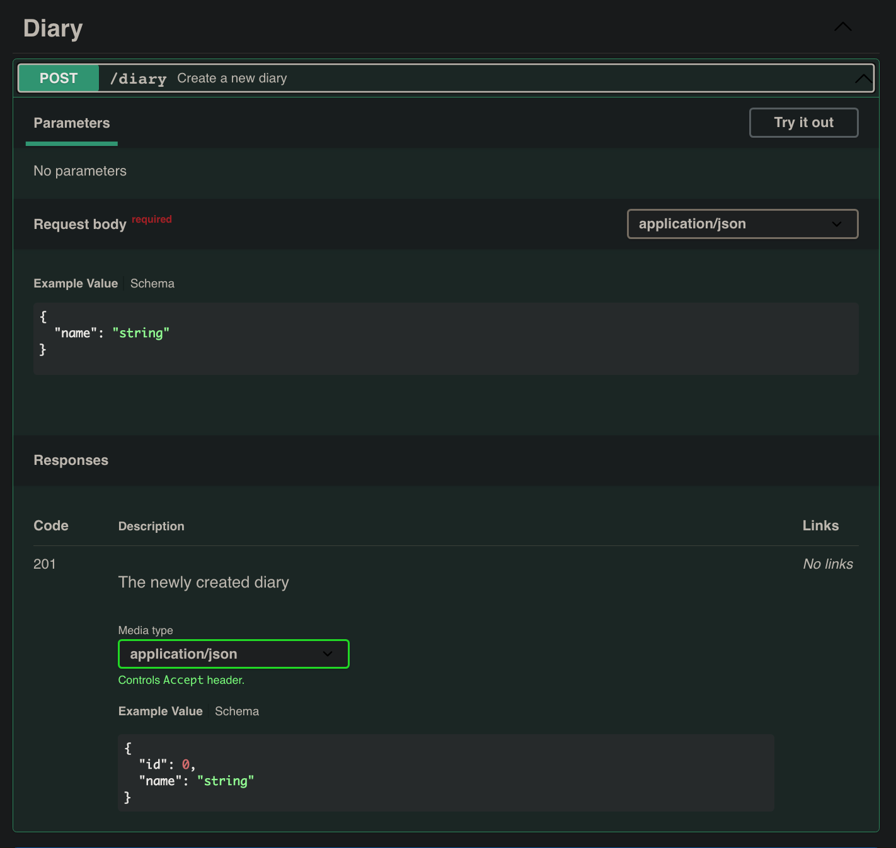

# Задание на 29.01

Вот мы и закончили с регистрацией пользователя, а так же логином. Теперь нам открыты все дороги и мы можем вовсю писать код.

Наша цель сейчас -- дать возможность пользователю создавать дневники, редактировать, смотреть список дневников и удалять их, обращаясь на ручки.

Посмотрим на документацию:



В request body мы видим то, что должны передать в body, а именно -- имя дневника. А в response то, что получим, в нашем случае имя и id.

Вот вариант, как мы можем это реализовать:
```python
from fastapi import FastAPI
from pydantic import BaseModel

app = FastAPI()
diary_db = {}

class Diary(BaseModel):
    id: int
    name: str

@app.post("/diary", tags=["Diary"])
async def create_diary(diary: Diary):
    if not diary.id:
        diary.id = len(diary_db) + 1
    diary_db[diary.id] = diary.dict()
    return {"id": diary.id, "name": diary.name}
```

Само собой вы должны использовать базу данных, а не словарь. 

Но в этом примере не учитывается пользователь, его нам обязательно нужно добавлять, иначе мы не сможем понять, кому какой словарь принадлежит. 