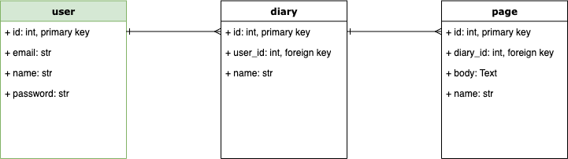

# Дневник?
Вот и выбран проект, можем приступать к разработке.

Я предлагаю определить, какие данные мы будем хранить:
- Пользователи
- Дневники (Будут разные у одного человека)
- Записи в дневниках

Вот мы выделили сущности. Как будем хранить? На листочке? Или в блокнот записывать? А может отсылать всю информацию на почту?

Лучше остановим полет фантазии и остановимся на том, что проверенно дедами не один десяток лет -- Реляционные базы данных. Их изучение будет у вас домашней работы, но немного дам объяснение.

Реляционные от слова relations, то есть должны быть связи. Связи организованы между сущностями, их мы выделили.

Самое простое понимание таких БД -- excel. Все с ним имели дело на информатике, тут та же петрушка, но мощнее.

Теперь взглянем, как наша база будет выглядеть.

### Все круто, но ничего непонятно.
Именно так, предстоит много сделать, но для начала все просто, нужно создать лишь один стол `user`.

Для этого вам нужно подключиться к postgres, добавить sqlalchemy в Fastapi, а затем с помощью классов заполнить таблицу.

